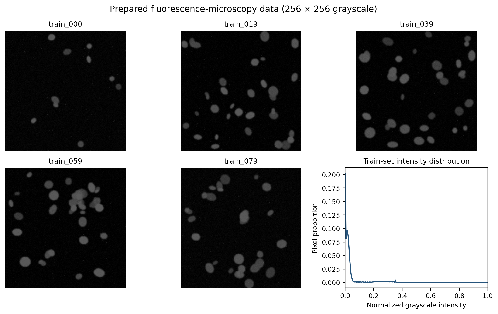
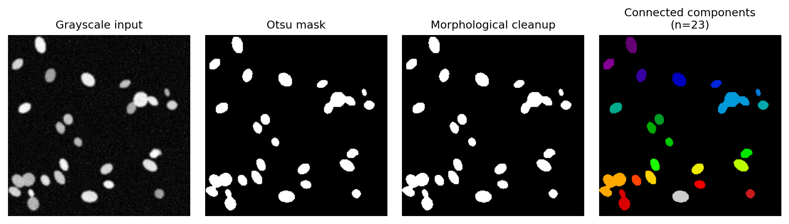
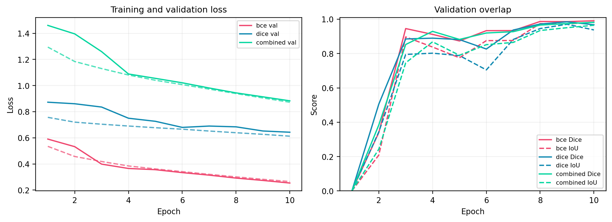
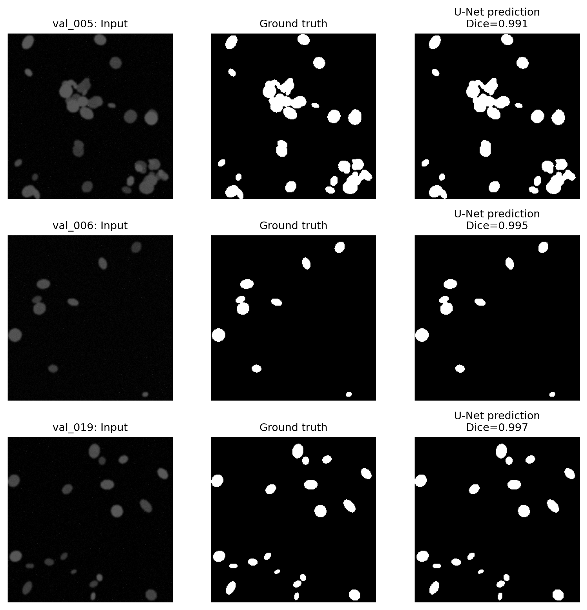
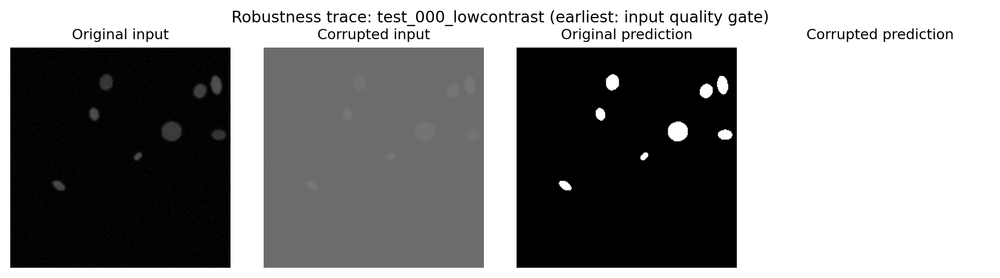

# Auditable Biomedical Image Analysis

## Overview

This project developed an auditable pipeline for synthetic fluorescence-microscopy images:

```text
raw image -> segmentation -> quantitative region features
          -> validated JSON -> short narrative
```

It compared a direct local vision-language model (VLM) description with a numbers-first description, evaluated classical and learned segmentation, and tested how image corruption propagates into later measurements and generated narratives.

## 1. Data and experimental design

The dataset contained 112 images: 80 training, 20 validation and 12 unseen test images. Every image was converted to 256 x 256 grayscale. Masks were resized using nearest-neighbour interpolation to preserve class labels.

The training experiments used seed 42, batch size 8, learning rate 0.001 and 10 epochs. BCE, Dice and combined BCE + Dice models used the same compact U-Net architecture, split, optimiser and training budget. Validation data alone determined the selected checkpoint and probability threshold.



*Figure 1. Representative prepared images and the training-set intensity distribution.*

The images have dark backgrounds and comparatively bright nuclei, explaining why intensity-based segmentation is already strong. Foreground coverage varies from 0.0138 to 0.2048, with a median of 0.0793. However, the narrow synthetic appearance is considerably less varied than real clinical microscopy.

## 2. Direct and numbers-first descriptions

### Task 1: Direct VLM description

The representative image was `train_026`. The naive prompt, `What is this image?`, produced unsupported medical context and suggested possible diagnostic use.

The optimised prompt prevented diagnosis, required JSON and explicitly permitted uncertainty. All three repeated runs returned valid but non-identical records. However, every run labelled the known fluorescence image as `brightfield`. This demonstrates that schema validity improves structure but does not guarantee factual accuracy.

<details>
<summary><strong>Task 1 optimised prompt</strong></summary>

```text
You are describing one educational biomedical image for a research audit.
Describe only visible image content. This is not a diagnostic task.

Return ONLY one valid JSON object with exactly these fields:
- modality: a short imaging-modality phrase, or "uncertain"
- tissue_type: a short tissue/specimen phrase, or "uncertain"
- notable_features: a JSON list of zero to three short, directly visible features
- image_quality: exactly "good", "acceptable", "poor", or "uncertain"

Rules:
- Do not diagnose disease, infer patient attributes, or invent clinical history.
- Use "uncertain" whenever the image alone does not justify a claim.
- Keep notable_features descriptive (brightness, shapes, distribution, artefacts).
- No Markdown, explanation, or text outside the JSON object.
```

</details>

Representative result:

```json
{
  "modality": "brightfield",
  "tissue_type": "uncertain",
  "notable_features": ["bright", "dark spots"],
  "image_quality": "good"
}
```

### Task 2: Classical segmentation and numbers-first description

Otsu thresholding, morphological cleanup and connected-component labelling produced a reproducible mask and region-properties table for `train_026`.



*Figure 2. Grayscale input, Otsu mask, cleaned mask and 23 connected components.*

The calculated summary contained 23 objects, moderate density, regular shape and an `ok` quality flag. Because the text model received only this numerical summary, every structured claim can be traced back to the saved feature table.

<details>
<summary><strong>Task 2 numbers-first prompt template</strong></summary>

```text
You are a quantitative biomedical-image analyst.
The input below is a deterministic NUMERICAL SUMMARY. You cannot see the image.
Use only these supplied numbers and calculated categories; do not diagnose or add anatomy.

Return ONLY valid JSON matching the supplied schema. Requirements:
- Copy n_objects exactly from the summary.
- Copy density_class_calculated to density_class exactly.
- Copy shape_regularity_calculated to shape_regularity exactly.
- Copy quality_flag_calculated to quality_flag exactly.
- narrative must be one objective paragraph of 2-4 sentences grounded in the numbers.
- If evidence is missing, say "uncertain" rather than guessing.

NUMERICAL SUMMARY: {summary}
```

</details>

Representative record:

```json
{
  "n_objects": 23,
  "density_class": "moderate",
  "shape_regularity": "regular",
  "quality_flag": "ok"
}
```

The direct VLM route is potentially more useful for describing visual context, but the numbers-first route is more trustworthy in this experiment because its claims are reproducible and measurable.

## 3. U-Net segmentation

Three U-Nets were compared under controlled experimental conditions.

| Method | Loss | Validation Dice | Validation IoU | Threshold |
|---|---:|---:|---:|---:|
| Otsu + morphology | Not applicable | 0.9697 | 0.9412 | Not applicable |
| U-Net | BCE | 0.9936 | 0.9874 | 0.60 |
| U-Net | Dice | 0.9913 | 0.9827 | 0.65 |
| **U-Net** | **BCE + Dice** | **0.9945** | **0.9891** | **0.70** |



*Figure 3. Loss, validation Dice and validation IoU across ten epochs.*

The combined loss achieved the highest validation Dice, although the difference from BCE was small and came from only one seed. The result therefore supports this checkpoint selection but does not establish that combined loss is universally superior.



*Figure 4. Three validation inputs with their ground-truth and selected U-Net masks.*

U-Net achieved higher Dice than Otsu on all 20 validation images. `val_012` showed the largest relative gain: 0.995 for U-Net compared with 0.963 for Otsu.

There was no validation image on which Otsu achieved higher Dice. The strongest classical example was `val_000`, where Otsu recovered the correct five-object count without requiring training, although U-Net also recovered five objects and achieved higher Dice. Dense scenes exposed an important limitation: on `val_004`, U-Net detected 45 connected components against 80 labelled objects despite excellent pixel overlap.

## 4. Hybrid analysis of unseen test images

The selected combined-loss U-Net processed all 12 unseen test images. Each prediction was converted into region measurements, a validated JSON record and a narrative. The aggregate results were saved to [`test_image_records.csv`](../final_outputs/task4/test_image_records.csv).

The unseen test results were:

- Mean Dice: **0.9943** (SD 0.0012)
- Mean IoU: **0.9887** (SD 0.0024)
- Density classes: 3 sparse, 7 moderate and 2 dense
- Numerically validated JSON records: 12 of 12

<details>
<summary><strong>Task 4 hybrid reporting prompt template</strong></summary>

```text
You are the final reporting stage of an auditable biomedical image pipeline.
The image has already been segmented and measured. You cannot see the image.
Use ONLY the numerical source record below. Do not diagnose, infer patient details, or add facts.

Return ONLY valid JSON matching the supplied schema. Requirements:
- Copy image_id, n_objects, mean_area, density_class_calculated, and
  quality_flag_calculated exactly into the corresponding record fields.
- narrative must be one objective paragraph of 2-4 sentences.
- Treat the structured record, not the prose, as the source of truth.
- If quality_flag is not "ok", explicitly say that review is recommended.

NUMERICAL SOURCE RECORD: {summary}
```

</details>

Example validated record:

```json
{
  "image_id": "test_000",
  "n_objects": 8,
  "mean_area": 191.75,
  "density_class": "sparse",
  "quality_flag": "ok"
}
```

The associated narrative nevertheless stated that review was recommended for a quality flag of `ok`. The numerical record passed validation, but the prose contradicted it. This shows why downstream computation must use the structured record and why narrative-level semantic checks remain necessary.

## 5. Corruption propagation

All four supplied corruptions were first detected by the input-quality gate. Segmentation still degraded substantially:

| Corruption | Original Dice | Corrupted Dice | Original objects | Corrupted objects |
|---|---:|---:|---:|---:|
| `test_000_blur` | 0.9961 | 0.7422 | 8 | 7 |
| `test_000_lowcontrast` | 0.9961 | 0.0457 | 8 | 1 |
| `test_004_blur` | 0.9932 | 0.7111 | 42 | 14 |
| `test_004_lowcontrast` | 0.9932 | 0.3557 | 42 | 1 |



*Figure 5. Low contrast was detected at the input gate, but it still collapsed the predicted mask to one component.*

The low-contrast `test_000` image demonstrates the complete failure chain: contrast degradation was detected, Dice fell from 0.9961 to 0.0457, the measured object count fell from 8 to 1, and the narrative confidently described the resulting record. A quality warning should therefore block or clearly qualify reporting rather than merely accompany it.

## 6. Critical conclusions

1. **Which description is more useful and trustworthy?**  
   Direct VLM output may be more expressive, but it misidentified the modality and varied between runs. The numbers-first description was more trustworthy because its claims could be recomputed from the saved measurements.

2. **Did U-Net improve on Otsu?**  
   U-Net improved mean validation Dice from 0.9697 to 0.9945 and had higher Dice on every validation image. Otsu remained valuable as a transparent and inexpensive baseline but did not produce a numerical overlap win.

3. **What do Dice and IoU reveal?**  
   The high scores indicate very small pixel-level disagreement on this synthetic distribution. Remaining errors occurred around boundaries and where touching nuclei were merged. Pixel overlap alone did not guarantee accurate instance counts.

4. **Where can the LLM hallucinate?**  
   The direct VLM can invent modality, tissue or clinical context. The text model can add unsupported narrative claims even when its JSON fields are correct. Descriptive prompts, uncertainty, schema checks, numerical equality validation and retained raw replies reduce this risk.

5. **Would this system be trusted clinically?**  
   No. The dataset is small, synthetic and drawn from one narrow distribution. The most important improvement would be external evaluation using a representative multi-centre clinical dataset with independently adjudicated labels and pre-specified acceptance criteria.

## References

1. Dice, L. R. (1945). Measures of the amount of ecologic association between species. *Ecology, 26*(3), 297-302. <https://doi.org/10.2307/1932409>
2. Otsu, N. (1979). A threshold selection method from gray-level histograms. *IEEE Transactions on Systems, Man, and Cybernetics, 9*(1), 62-66. <https://doi.org/10.1109/TSMC.1979.4310076>
3. Ronneberger, O., Fischer, P., and Brox, T. (2015). U-Net: Convolutional networks for biomedical image segmentation. *MICCAI, LNCS 9351*, 234-241. <https://doi.org/10.1007/978-3-319-24574-4_28>
4. World Health Organization. (2024). *Ethics and governance of artificial intelligence for health: Guidance on large multi-modal models*. WHO.

